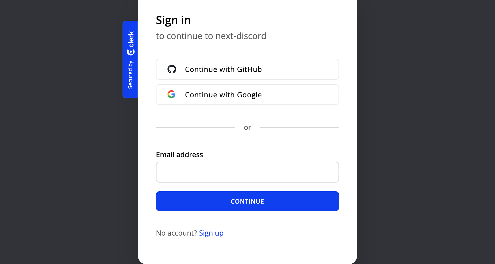

# Next Discord App

## [👉🏻 Live Link 👈🏻](https://next-discord.onrender.com/)

## Tech Stack

&nbsp;&nbsp;

&nbsp;&nbsp;

&nbsp;&nbsp;

&nbsp;&nbsp;

&nbsp;&nbsp;

&nbsp;&nbsp;

&nbsp;&nbsp;

&nbsp;&nbsp;

&nbsp;&nbsp;

&nbsp;&nbsp;

## Features

-   `Next Discord` is a full stack application similar to discord built in NextJS.
-   Authentication options are - `Email`, `Google`, `GitHub` implemented using `Clerk Auth`.
-   There are 3 types of `Users` - `Admin`, `Moderator` and `Guest User`.
-   `Users` can create `Servers` and `Channels`. They can send invite link to join a `Server`.
-   `Users` can have group chats in `Channels` and also send `Direct Messages` to other `Users` and also share `Images` and `PDFs`.
-   `Server Admins` have the option to manage `Users`, they can create and remove `Moderators` and delete other users messages. `Moderators` can delete other users messages.
-   User can switch between `light` and `dark` mode.

## Screenshots

-   #### Autentication Page
    
